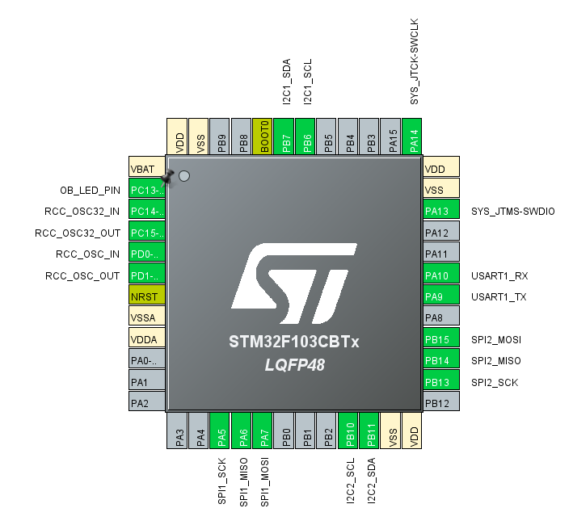

# STM32F103CB 評価F/W開発

## 開発環境

- マイコン: `STM32F103CBT6`
  - CPU: ARM Cortex-M3
  - FPU: (N/A)
  - Clock: 72 MHz
  - Flash: 128 KB
  - SRAM: 20 KB
- コンパイラ: Clang (`st-arm-clang 19.1.6`)
  - 最適化: debug
- ツールチェイン
  - CMake
  - STM32CubeMX
  - STM32CubeIDE (VSCode版)
- デバッグ
  - デバッガ: `ST-LINK/V2-1`
    - デバッグI/F: SWD
  - printf()デバッグ
    - UART
      - TX: PA9ピン
      - RX: PA10ピン
      - 921600bps 8N1

## メモリ使用量

```shell
[build] Memory region         Used Size  Region Size  %age Used
[build]              RAM:        1544 B        20 KB      7.54%
[build]            FLASH:        4140 B       128 KB      3.16%
```

## ピンアサイン


